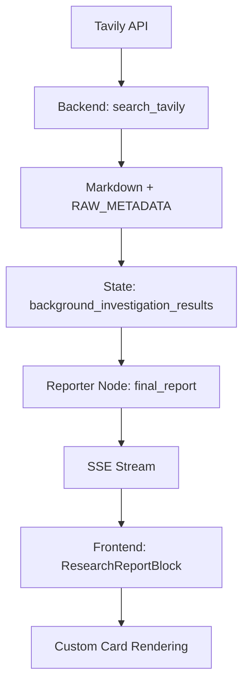

# DeerFlow Platform Support: Social & Web Search Integration

## 📁 Repository Reference

- **Backend:** `src/tools/tavily_search/tavily_search_api_wrapper.py`, `src/graph/nodes.py`
- **Frontend:** `web/src/app/chat/components/research-report-block.tsx`
- **Docs Reference:** [11cafe/jaaz](https://github.com/11cafe/jaaz) — open-source AI design agent with multi-platform support

---

## 🧠 Platform Integration Mechanics

### 1. Tavily API Integration & Normalization

- **API Call:**
  - POST request to Tavily API with query, max_results, and optional domain (e.g., twitter.com, instagram.com).
  - Receives structured results (title, url, content, image, author, timestamp, etc.).
- **Normalization:**
  - Deduplicate results by URL/content.
  - Format each result as Markdown with:
    - Title (with badge and link)
    - Author and timestamp (prominently, under the title)
    - Image (if present, shown immediately after metadata)
    - Content/summary (truncated if long)
    - Source link
    - `<!-- RAW_METADATA: ... -->` hidden JSON for frontend parsing

**Example Markdown Output:**
```markdown
🌐 **[Sora (@soraofficial) • Instagram photos and videos](https://instagram.com/soraofficial)**
👤 **User:** soraofficial  🕒 **Time:** 2025-06-24 20:33


114K Followers, 32 Following, 152 Posts – Sora (@soraofficial) on Instagram: "The official account for @openai's image & video generation tool Sora."

🔗 [Open in instagram.com](https://instagram.com/soraofficial) 🏷️ **Source:** instagram.com
<!-- RAW_METADATA: { ... } -->
```

---

### 2. State Management & SSE Pipeline

- **State:** Tavily Markdown results are stored in `background_investigation_results` and included in `final_report`.
- **SSE:** The `final_report` (with all Markdown and metadata) is streamed to the frontend via SSE, preserving all formatting and metadata.
- **Propagation:** All Tavily data (text, images, metadata) is preserved end-to-end.

---

### 3. Frontend Rendering & Custom Cards

- **Parsing:** Markdown is parsed for Tavily result blocks using the `<!-- RAW_METADATA: ... -->` marker.
- **Custom Cards:** Each Tavily result is rendered as a visually distinct card, with:
  - Title, badge, and link
  - Author and timestamp (with icons)
  - Image preview (if present)
  - Content/summary
  - Source link
- **Fallback:** Remaining Markdown (LLM summary, etc.) is rendered as usual.

**Example Card Rendering (React/TSX):**
```tsx
<div className="rounded-lg border p-4 mb-4 bg-muted">
  <div className="flex items-center gap-2 mb-2">
    <span>{block.meta?.platform_emoji || "🌐"}</span>
    <a href={block.meta?.url} target="_blank" rel="noopener noreferrer" className="font-bold underline">
      {block.meta?.title || block.meta?.url}
    </a>
  </div>
  <div className="text-sm text-muted-foreground mb-2">
    {block.meta?.author && <span className="mr-4">👤 {block.meta.author}</span>}
    {block.meta?.timestamp && <span>🕒 {block.meta.timestamp}</span>}
  </div>
  {block.meta?.image_url && }
  <div className="mb-2">
    <Markdown>{block.meta?.content || ""}</Markdown>
  </div>
  <div>
    <a href={block.meta?.url} target="_blank" rel="noopener noreferrer" className="text-blue-600 underline">
      🔗 Open in {block.meta?.platform || "source"}
    </a>
  </div>
</div>
```

---

## 🔍 Data Flow Diagram



---

## 🏷️ Metadata & Image Handling

- **Image Links:** Preserved in both Markdown and RAW_METADATA; rendered as previews in frontend cards.
- **Metadata:** Author, timestamp, and source are included and displayed with icons; accessible for further UX enhancements.
- **RAW_METADATA:** Enables structured access to all fields for custom rendering or analytics.

---

## 🛠️ Normalization Steps

- Deduplicate results by URL/content.
- Truncate long content with “Read more” links.
- Standardize timestamp format (human-readable).
- Consistent use of badges/emojis for platform.
- Ensure all image URLs are absolute and valid.
- Optionally, filter out low-quality/duplicate results more aggressively.

---

## 💡 UX Suggestions for Rich Media & Deep Links

- Show image previews as banners or thumbnails; add lightbox/modal for enlargement.
- Display video previews if available (future).
- Use badges or chips for platform/source.
- Add tooltips or hover cards for links (showing summary/preview).
- Use “Open in new tab” icons for external links.
- Highlight verified or official sources.
- Allow users to collapse/expand Tavily result cards.
- Add copy/share buttons for URLs or content.
- Group results by platform or relevance if many are returned.

---

## ✅ Summary Table

| Feature                | Supported? | Notes/Suggestions                        |
|------------------------|------------|------------------------------------------|
| Text Results           | ✅         | Markdown and custom card rendering       |
| Image Previews         | ✅         | Prominent, with fallback if missing      |
| Metadata (author/time) | ✅         | Displayed with icons, accessible         |
| Source/Platform        | ✅         | Badge, link, and RAW_METADATA            |
| Deduplication          | ✅         | By URL/content, can be tuned further     |
| Rich Media UX          | ⚡️         | Lightbox, video, grouping (future)       |
| Deep Link UX           | ⚡️         | Tooltips, share/copy, verified badges    |

---

## 📚 Reference: Jaaz (Open Source AI Design Agent)

- [11cafe/jaaz on GitHub](https://github.com/11cafe/jaaz)
- Jaaz demonstrates modern, multi-platform AI agent design, supporting local/cloud models, image editing, and rich UI/UX for creative workflows.
- DeerFlow’s platform support is inspired by such open, extensible architectures. 