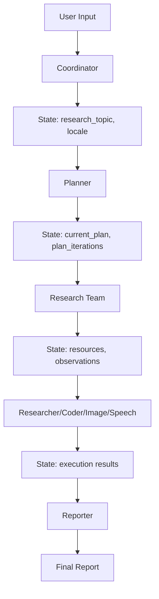
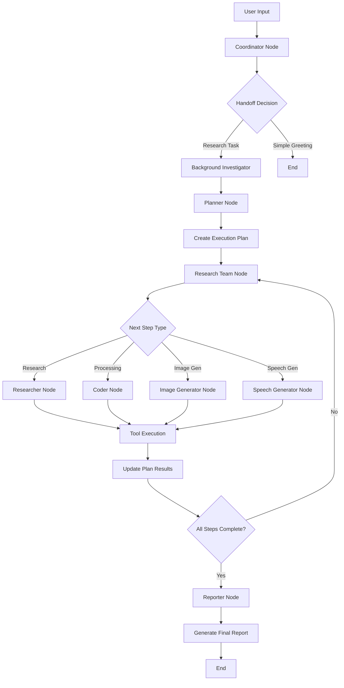

# Deer Flow Agent Mechanics Deep Dive

## 📁 Repository Reference

**File Paths Involved:**
- `src/agents/` - Agent factory and creation logic
- `src/graph/` - LangGraph workflow and state management
- `src/prompts/` - Prompt templates and application logic
- `src/tools/` - Tool definitions and implementations
- `src/workflow.py` - Main workflow orchestration

**Agent Flow Analyzed:** Multi-agent research workflow (coordinator → planner → research team → reporter)

## 🧠 Agent Mechanics Analysis

### 1. Prompt Construction

#### How Prompts Are Assembled and Updated

**Location:** `src/prompts/template.py`

```python
def apply_prompt_template(
    prompt_name: str, state: dict, configurable: Optional[Configuration] = None
) -> list:
    """Apply template variables to a prompt template and return formatted messages."""
    state_vars = {
        "CURRENT_TIME": datetime.now().strftime("%a %b %d %Y %H:%M:%S %z"),
        **state,
    }
    
    if configurable:
        state_vars.update(dataclasses.asdict(configurable))
    
    template = env.get_template(f"{prompt_name}.md")
    system_prompt = template.render(**state_vars)
    return [{"role": "system", "content": system_prompt}] + state["messages"]
```

**Key Characteristics:**
- **Jinja2 Templating**: Uses Jinja2 for dynamic prompt construction
- **State Injection**: All state variables are injected into prompt context
- **Configuration Merge**: Runtime configuration is merged with state
- **Message History**: Previous messages are appended to system prompt

**Prompt Update Flow:**
1. State variables are extracted from current state
2. Current timestamp is added automatically
3. Configuration object is serialized and merged
4. Jinja2 template renders with all variables
5. System prompt + message history returned as list

### 2. State Management

#### Where State is Stored, Modified, and Reset

**Location:** `src/graph/types.py`

```python
class State(MessagesState):
    """State for the agent system, extends MessagesState with next field."""
    
    # Runtime Variables
    locale: str = "en-US"
    research_topic: str = ""
    observations: list[str] = []
    resources: list[Resource] = []
    plan_iterations: int = 0
    current_plan: Plan | str = None
    final_report: str = ""
    auto_accepted_plan: bool = False
    enable_background_investigation: bool = True
    background_investigation_results: str = None
```

**State Persistence:**
- **LangGraph MessagesState**: Inherits from LangGraph's built-in state management
- **Memory Checkpointing**: Optional persistent memory via `MemorySaver`
- **State Updates**: Each node returns `Command(update={...})` to modify state
- **Cross-Turn Persistence**: State is preserved across all workflow turns

**State Modification Points:**
1. **Coordinator Node**: Sets `research_topic`, `locale`
2. **Planner Node**: Updates `current_plan`, `plan_iterations`
3. **Research Team**: Updates `resources`, `observations`
4. **Reporter Node**: Sets `final_report`

### 3. Context Sharing

#### How Context is Passed Between Agents/Tools

**Context Flow Architecture:**



**Context Sharing Mechanisms:**

1. **State Inheritance**: All nodes receive full state object
2. **Message History**: Previous conversations preserved in `state["messages"]`
3. **Resource Accumulation**: Research results stored in `state["resources"]`
4. **Plan Persistence**: Current plan maintained across execution steps
5. **Tool Results**: Tool outputs added to message history

**Context Preservation:**
- **Cross-Node Context**: Each node can access all previous state
- **Tool Context**: Tool results are preserved in message history
- **Plan Context**: Execution plan and results maintained throughout workflow
- **Resource Context**: Retrieved resources available to all subsequent agents

### 4. Tool Usage

#### How Agents Decide When and Which Tool to Invoke

**Tool Decision Making:**

**Location:** `src/graph/nodes.py` (coordinator_node)

```python
def coordinator_node(state: State, config: RunnableConfig):
    response = (
        get_llm_by_type(AGENT_LLM_MAP["coordinator"])
        .bind_tools([handoff_to_planner])
        .invoke(messages)
    )
    
    tool_calls = getattr(response, "tool_calls", None)
    if tool_calls and len(tool_calls) > 0:
        goto = "planner"
        if state.get("enable_background_investigation"):
            goto = "background_investigator"
```

**Tool Selection Logic:**

1. **LLM-Driven Decisions**: Agents use LLM to decide tool usage
2. **Tool Binding**: Tools are bound to agents via `.bind_tools()`
3. **Conditional Routing**: Tool calls trigger conditional graph routing
4. **Dynamic Tool Loading**: MCP tools can be loaded dynamically

**Tool Decision Flow:**
1. Agent receives state and available tools
2. LLM analyzes task and available tools
3. LLM decides which tool(s) to invoke
4. Tool calls are extracted from response
5. Graph routes to appropriate next node based on tool usage

### 5. Agent-Tool Flow

#### Full Cycle: Input → Planning → Tool → Result

**Complete Workflow Cycle:**



**Detailed Flow Breakdown:**

#### Phase 1: Input Processing
```python
# src/workflow.py
initial_state = {
    "messages": [{"role": "user", "content": user_input}],
    "auto_accepted_plan": True,
    "enable_background_investigation": enable_background_investigation,
}
```

#### Phase 2: Coordinator Decision
```python
# src/graph/nodes.py - coordinator_node
messages = apply_prompt_template("coordinator", state_dict)
response = get_llm_by_type(AGENT_LLM_MAP["coordinator"]).bind_tools([handoff_to_planner]).invoke(messages)

if tool_calls and len(tool_calls) > 0:
    goto = "planner" if not state.get("enable_background_investigation") else "background_investigator"
```

#### Phase 3: Planning
```python
# src/graph/nodes.py - planner_node
messages = apply_prompt_template("planner", state_dict, configurable)
response = llm.invoke(messages)
# Parse plan and update state.current_plan
```

#### Phase 4: Execution
```python
# src/graph/nodes.py - _execute_agent_step
messages = [
    *state["messages"],
    {"role": "user", "content": apply_prompt_template("researcher", {...})}
]
response = agent.astream(messages)
step.execution_res = full_response
```

#### Phase 5: Result Aggregation
```python
# src/graph/nodes.py - reporter_node
messages = apply_prompt_template("reporter", state_dict, configurable)
response = llm.stream(messages)
# Generate final report with all accumulated results
```

## 🔍 Key Insights and Risks

### Strengths
1. **Modular Design**: Clear separation between agents, tools, and workflow
2. **State Persistence**: Comprehensive state management across turns
3. **Dynamic Tool Loading**: MCP integration for extensible tooling
4. **Conditional Routing**: Flexible workflow based on agent decisions
5. **Context Preservation**: Full conversation history maintained

### Potential Risks
1. **State Complexity**: Large state object could impact performance
2. **Tool Decision Ambiguity**: LLM-driven tool selection may be unpredictable
3. **Context Window Limits**: Long conversations may hit token limits
4. **Error Propagation**: Tool failures could cascade through workflow
5. **Memory Management**: Persistent memory could grow unbounded

### Recommendations
1. **State Optimization**: Consider state pruning for long conversations
2. **Tool Validation**: Add validation for LLM tool decisions
3. **Context Window Management**: Implement conversation summarization
4. **Error Handling**: Add comprehensive error recovery mechanisms
5. **Memory Cleanup**: Implement memory cleanup policies

## 📊 Summary Table

| Phase | State Location | Prompt Assembly | Context Sharing | Tool Decision | Risk Level |
|-------|---------------|-----------------|-----------------|---------------|------------|
| Input Processing | `workflow.py` | None | User input only | None | Low |
| Coordinator | `coordinator_node` | Jinja2 template | Full state | LLM + handoff_tool | Medium |
| Planning | `planner_node` | Jinja2 template | Research context | LLM planning | Medium |
| Execution | `_execute_agent_step` | Step-specific | Plan + resources | LLM + bound tools | High |
| Reporting | `reporter_node` | Jinja2 template | All accumulated | LLM synthesis | Low |

This analysis provides a comprehensive view of how Deer Flow's agent system operates, highlighting both its strengths and areas for improvement as the system scales. 